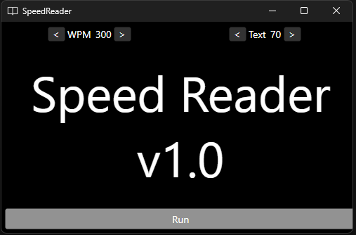

# SpeedReader
Reads your Clipboard and displays each word one by one to help you read faster.

# Running
If you have Visual Studio and .Net 7 installed, you only have to open SpeedReader.sln and hit F5

# Building as single file exe
If you want to build it as a single file exe, you only need to run "Publish NativeAOT - Windows.bat".

This bat file will download all NativeLib dependencies (hosted in my StaticFiles git repository) 
and compilethe application as a NativeAOT one and place the SpeedReader.exe in the root folder.
You'll now be able to run the app anywhere!
